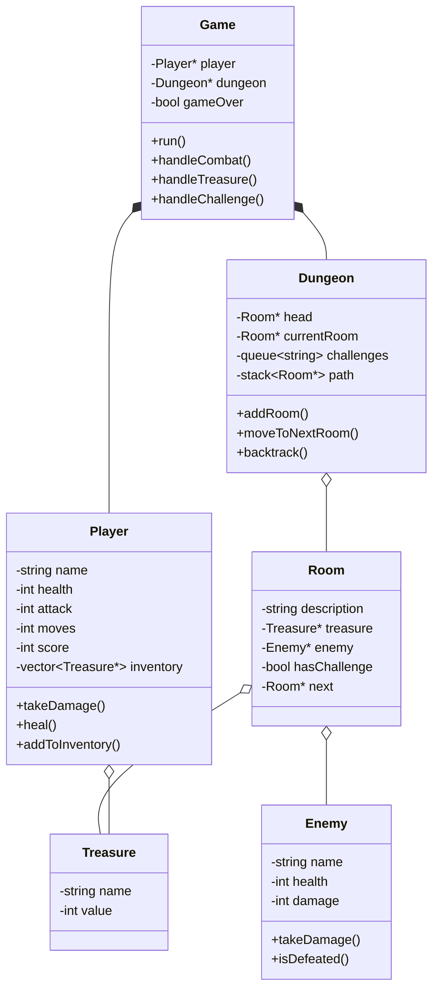

# Class Diagram

GitHub renders this Mermaid diagram automatically.

```mermaid
classDiagram
    class Game {
        -Player* player
        -Dungeon* dungeon
        -bool gameOver
        +run()
        +handleCombat()
        +handleTreasure()
        +handleChallenge()
    }

    class Player {
        -string name
        -int health
        -int attack
        -int moves
        -int score
        -vector~Treasure*~ inventory
        +takeDamage()
        +heal()
        +addToInventory()
    }

    class Dungeon {
        -Room* head
        -Room* currentRoom
        -queue~string~ challenges
        -stack~Room*~ path
        +addRoom()
        +moveToNextRoom()
        +backtrack()
    }

    class Room {
        -string description
        -Treasure* treasure
        -Enemy* enemy
        -bool hasChallenge
        -Room* next
    }

    class Enemy {
        -string name
        -int health
        -int damage
        +takeDamage()
        +isDefeated()
    }

    class Treasure {
        -string name
        -int value
    }

    Game *-- Player
    Game *-- Dungeon
    Dungeon o-- Room
    Room o-- Enemy
    Room o-- Treasure
    Player o-- Treasure
```
